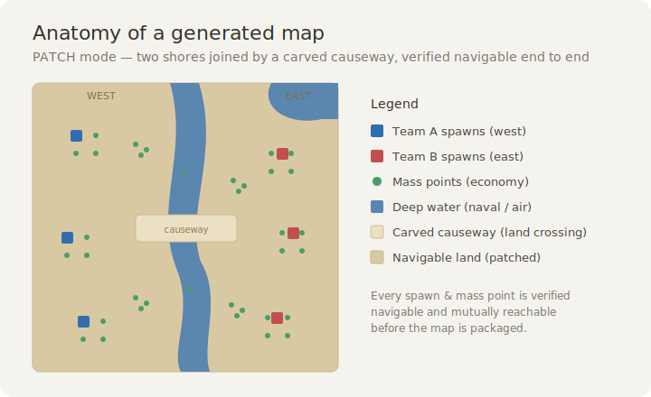

# Supreme Commander 2 Map Toolkit

Make custom maps for **Supreme Commander 2** — a game that shipped **no map editor**
and was long considered un-moddable for maps.

This toolkit is the result of reverse-engineering SC2's map file formats, including
the one nobody had cracked: the **navigation mesh**. With it you can read any shipped
terrain, score terrains by open space, lay out a skirmish map, and — crucially —
**patch the navmesh so units actually move** on terrain the game never enabled for
skirmish (e.g. campaign maps). The navmesh patch is confirmed working in-game,
**including multiplayer** (lockstep-safe: island metadata is rebuilt consistently;
all players must share the byte-identical `.scd`).



> **You need your own legally-owned copy of Supreme Commander 2.** This tool reads the
> game files installed on your machine; it does **not** contain or redistribute any
> game assets. Maps you build bundle terrain data from your own install — share those
> only with people who also own the game.

## Quick start

```bash
# Python 3.9+ (standard library only — no pip installs needed)
python make_map.py dune_rift_3v3      # build, verify, and install an example map
```

Then launch SC2 → Skirmish; the map appears in the list. (SC2 reads map archives at
launch, so restart the game after building.)

The toolkit auto-detects your Steam install. If it can't find it, set an env var:

```bash
# Windows (PowerShell)
$env:SC2_GAMEDATA = "D:\SteamLibrary\steamapps\common\Supreme Commander 2\gamedata"
```

## Make your own map

`make_map.py` ships five worked specs you can build right now or copy from:
`dune_rift_3v3` (PATCH: campaign desert, two shores + causeway), `open_range_3v3`,
`four_corners_ffa`, `duel_1v1`, and `etched_desert_2v2` (all REMIX). To make your own,
copy one in `SPECS` and tweak it:

```python
from make_map import build_map

build_map(dict(
    terrain="SC2_MP_302",                 # base terrain (see sc2maps.TERRAINS)
    scenario_id="SC2_MYMAP",              # new map id
    name="[4] My Map (2v2)",              # lobby name
    out="_my_map.scd",
    anchors={1:(342,633), 2:(682,392), 3:(631,682), 4:(390,343)},  # spawn x,z
    teams=[[1,2],[3,4]],
    economy=dict(base_mass=4, sites=6, per_site=2),
    patch=None,                           # None = remix a navigable skirmish terrain
))
```

`build_map` places spawns and economy **only on navigable ground**, then **verifies
every position is navigable and all spawns are mutually reachable** before packaging.
It refuses to ship a map that fails verification — so you won't get the classic
"units won't move" failure.

### Two kinds of map

| Mode | When | What ships |
|------|------|-----------|
| **REMIX** (`patch=None`) | base is a stock **skirmish** terrain (already navigable everywhere) | just the Lua — tiny, 100% safe |
| **PATCH** (`patch=dict(...)`) | base is **campaign** terrain (only a small baked navmesh) | full terrain set under a new id, with a rewritten navmesh so your play area is one connected navigable island |

PATCH mode is the breakthrough. Example (open a campaign desert and bridge its two shores):

```python
patch=dict(max_slope=6, water_margin=4, seed=(160,500),
           causeways=[(360, 701, 470, 561)])   # carve a ford across the water
```

Campaign terrains carry ambient scenery props (e.g. the Illuminate desert's roaming
"Mine Crawler"). PATCH builds neutralize moving props by default (`strip_props="moving"`)
so your map doesn't inherit wandering vehicles; set `strip_props=False` to keep them,
`"all"` to drop every prop, or a tuple of name substrings to target specific ones.

### Making campaign terrain buildable

Campaign terrains are often navigable after a PATCH but too **undulating to build on**
(SC2 needs flatter ground to place a structure than to move a unit across). Two spec keys
fix that:

```python
smooth=dict(keep_slope=6.0, water_margin=4.0)   # level ALL gentle land flat -> broadly buildable
flatten=[("disc", 300, 500, 72)]                 # or flatten only specific pads / plains
```

`smooth` defaults to `mode="level"`: it sets the gentle land to one flat height (reliable,
dead-flat buildable), keeping cliffs (original slope > `keep_slope`) and water as the only
no-build areas. Pass `mode="smooth"` to box-blur instead (keeps undulation but may leave
some ground unbuildable). On the Illuminate desert this took buildable area from ~34% to ~95%.

## What's in here

| File | Purpose |
|------|---------|
| [`sc2maps.py`](sc2maps.py) | The library: BDF read/write, `Terrain` loader (heightfield + water + navmesh), navmesh patcher, Lua/minimap generators, `.scd` packager, installer, and a terrain catalog. Fully documented. |
| [`make_map.py`](make_map.py) | High-level `build_map(spec)` driver + example specs. Start here. |
| [`FORMATS.md`](FORMATS.md) | Byte-level reference for every map file format (the reverse-engineering payoff). |

Useful library calls:

```python
import sc2maps as sm
t = sm.Terrain("SC2_CA_I01")     # load a terrain
t.openness()                     # largest connected navigable fraction (0..1)
sm.TERRAINS                      # catalog: biome, water level, openness, navmesh type
sm.list_installed()              # installed custom maps
sm.uninstall("_my_map.scd")      # remove one
```

## How the navmesh crack works (short version)

`costs.win.bdf` holds, per movement class, a 1024×1024 grid where **1 = walkable,
255 = blocked**, plus a connected-region ("island") grid. The engine reads this
**pre-baked** grid at load and does *not* recompute it — so rewriting those bytes and
re-packing the file changes where units can go. Campaign terrains only bake a small
region (the mission area); this tool floods the dry, gently-sloped terrain into one
big navigable island and (optionally) carves causeways across water. Full byte-level
detail in [`FORMATS.md`](FORMATS.md).

## The render mesh — editing what you SEE

The single most important engine fact (proven in-game with paired mesh-only /
heightfield-only edits on two maps): **SC2 draws every map from a precompiled
mesh inside `terrain.win.bdf`; the heightfield drives gameplay only** (unit
height, navigation, buildability). Sculpting the heightfield alone changes an
*invisible* world. To visibly reshape a map, edit **both** layers:

```python
import sc2maps as sm

t = sm.Terrain("SC2_MP_302")
hf0 = t.raw["hfield.win.bdf"]
hf1 = sm.reshape_hfield(hf0, [("disc", 512, 512, 60, 70.0, "set")])  # gameplay
terr, moved = sm.resample_mesh_heights(                              # visuals
    t.raw["terrain.win.bdf"], hf0, hf1,
    bvh_min_y=40.0, bvh_max_y=75.0)          # widen culling bounds to cover
```

`resample_mesh_heights` finds the mesh's plain-float vertex buffer (it sits in
a fixup-free region, so in-place edits are safe), gates on mesh/heightfield
correlation (r > 0.9) so it refuses unfamiliar layouts, applies the height
*delta* per vertex (preserving sub-sample mesh detail), and skips the water
sheet / horizon skirt / underplanes automatically. This is how a coastline can
be pushed out, a strait carved through an island, or a border berm raised —
and have it actually show on screen.

Two companion discoveries matter for water and scenery:

- **Water is masked by a texture the terrain file references by PATH.** The
  visible water is a full-map sheet clipped per-pixel by `waterDepth.dds` —
  loaded via a path string inside `terrain.win.bdf`. Ship a map under a new id
  and it keeps clipping with the *donor's* mask until you retarget the string
  (`retarget_waterdepth_path`, same-length ids) and provide a replacement mask
  with the full mip chain (`write_waterdepth_dds_mips`).
- **Scenery props are positionally editable** (`edit_props`): each 44-byte
  MapProp record carries a plain float3 position. Sink a prop (y = −100) to
  remove it, or relocate it (trees make excellent visible map-border markers —
  geometry alone reads poorly from the top-down camera because lighting is
  baked).

Known cosmetic limits: per-vertex normals are baked, so re-heighted ground
keeps its old shading, and steep new slopes stretch the old texture.

## Caveats

- The build-time check guarantees the *map data* is sound (every position navigable,
  all spawns reachable). It does **not** guarantee the skirmish AI plays a given terrain
  well — do a quick test match before a serious game.
- What's *not* cracked: adding a water system to a map that ships dry (the water
  sheet + shader setup are baked), recomputing baked lighting/normals, per-region
  texture painting (re-skins are whole-layer), and the skybox / environment.
- Tested on Windows; path auto-detection includes Linux/macOS Steam locations but the
  game itself is Windows-era — your mileage may vary off-Windows.

## License

MIT — see [LICENSE](LICENSE). The license covers this toolkit's original code and
documentation only, not any Supreme Commander 2 assets (those remain © their owners).
